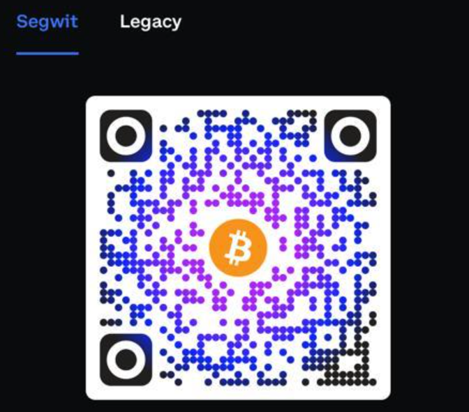

# Welcome to your Fresh Project with Apache ECharts

Congratulations on initializing your new Fresh project. You're all set and ready to start working immediately. For helpful guidelines, head over to the Fresh "Getting Started" guide available here: [Fresh Getting Started Guide](https://fresh.deno.dev/docs/getting-started).

## Harness the Power of Apache ECharts

Apache ECharts is your key to a universe full of dazzling and comprehensive charting possibilities.

Discover them all here: [Apache ECharts Examples](https://echarts.apache.org/examples/en/index.html).

Dreaming of infusing this charting magic into your Deno Fresh application? Rest easy! We've got your back.

### Let’s Get Started

Before you dive in, ensure that Deno is properly installed on your system. Here's a useful link to get you started: [Deno Installation](https://deno.land/manual/getting_started/installation)

Once you're ready, fire up the project with:

```shell
deno task start!
```

Now kick back and relax. This command will keep an eye on the project directory, restarting when necessary.
No point your browser to http://localhost:8000


# A Special Shout Out
Check out this useful resource on using Apache ECharts with React and TypeScript. Article on dev.to

https://dev.to/manufac/using-apache-echarts-with-react-and-typescript-353k

If you have found this useful and want to show your appreciation, how about buying us a beer:



segwit: bc1q3lxkq3pmtqm2uyf63wqcg0354mpcrw63wxy2fz